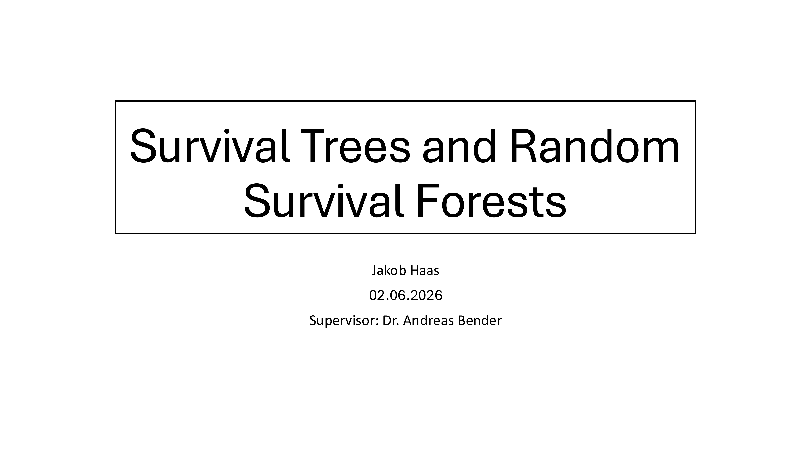
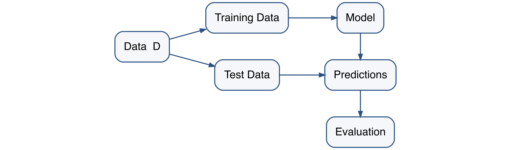
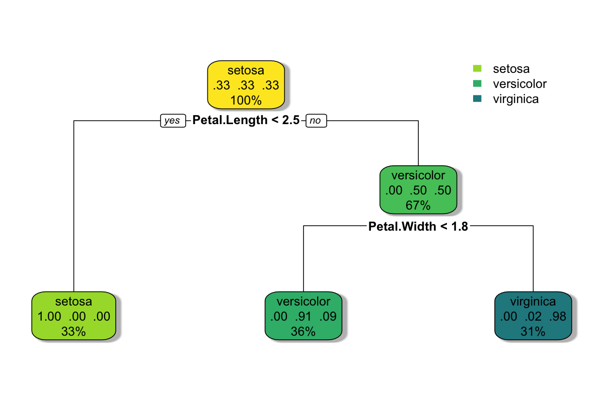
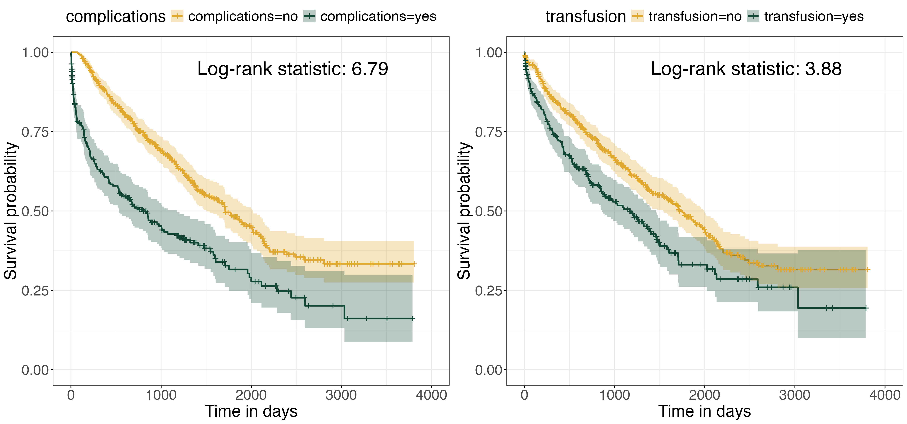
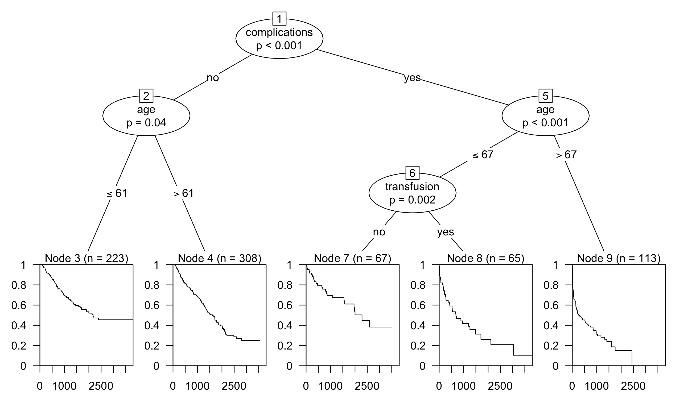
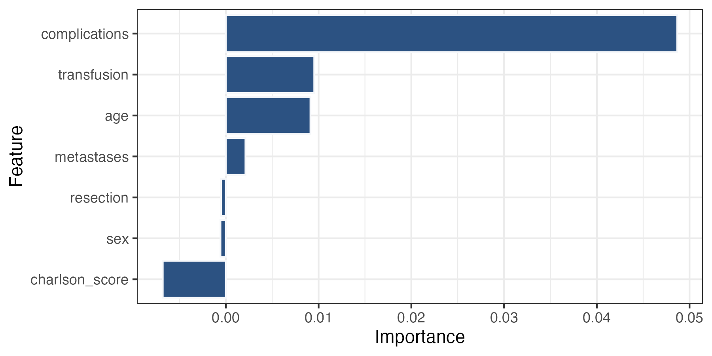
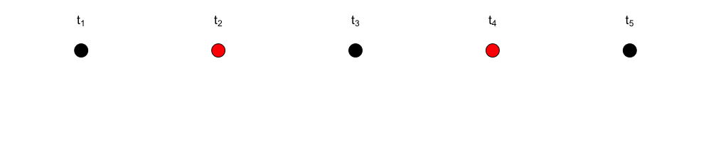
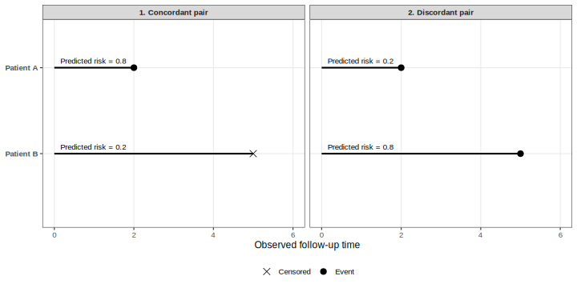
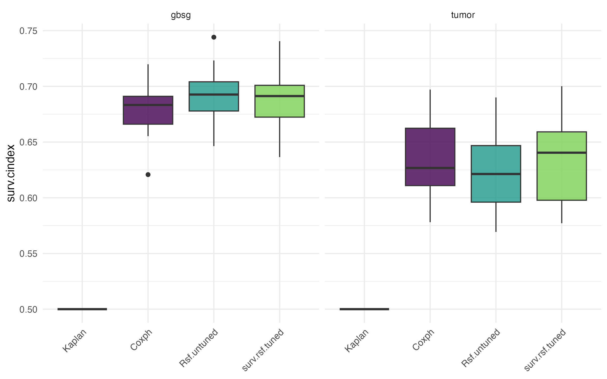
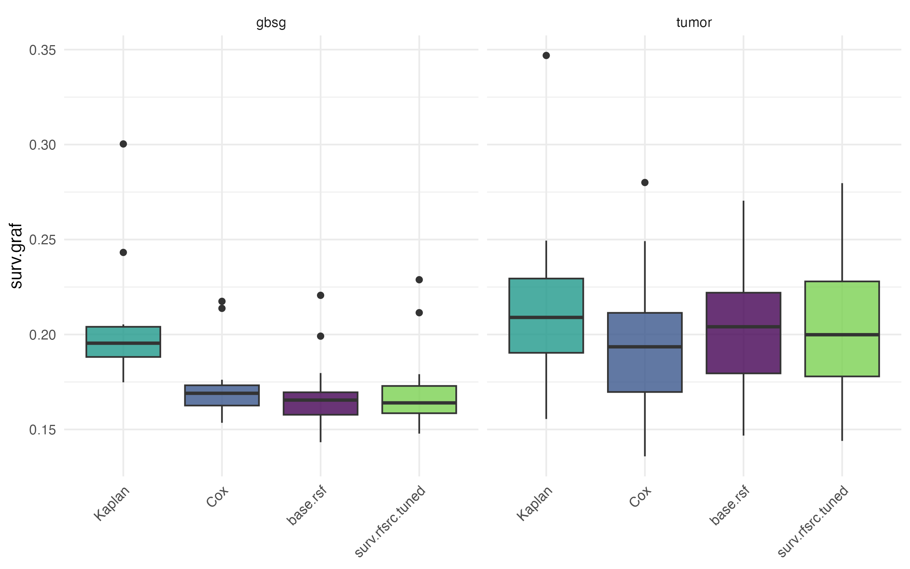

```{r setup, include=FALSE}
options(repos = c(CRAN = "https://cran.rstudio.com"))
source("setup.R")
```

## {.visibility-hidden}



## Introduction

- We have discussed various classical statistical approaches for handling survival data

::: {.fragment}

{width=90%}

:::

::: {.fragment}
- We now extend the machine learning workflow to survival data.
::: 


## Outline

1.  From CART to Survival Tree

2.  From Survival Tree to Random Survival Forest

3.  Evaluation

4.  Benchmark

5.  Conclusion


## CART: Construction

:::: {.columns}

::: {.column width = "45%"}
{width=100%}
:::

::: {.column width = "55%"}

**How CART works** [@breiman1984classification]

1.  Start with a root node that contains all the data

2.  Search for the feature $x_p$ and split point $c$ that minimize the empirical risk in the resulting child nodes

3.  Repeat recursively for each node

4.  Stop when a stopping criterion is reached. Nodes that are no longer split are terminal nodes.


:::

::::

## CART: Prediction


:::: {.columns}

::: {.column width = "45%"}
{width=100%}
:::


::: {.column width = "55%"}
**New Observation:**
```{r}
new.observation <- data.frame(
  Feature = c("Sepal Length", "Sepal Width", "Petal Length", "Petal Width"),
  Value = c(5.1, 3.5, 2.8, 0.2)
)

new.observation|>
  gt() |>
  cols_label(
    Feature = "Feature",
    Value = "Observed Value"
  ) |>
  fmt_number(
    columns = Value,
    decimals = 1
  ) |>
  tab_options(
    table.font.size = px(18),
    column_labels.font.weight = "bold",
    table.width = pct(90),
    data_row.padding = px(5)
  )
```

::: {.fragment}

$\Rightarrow$ Hard-Label Prediction: 
$$
\widehat{Y} = \text{versicolor}
$$   

::: 
:::
::::


## From CART to Survival Tree

- Now we want to apply this idea to survival data
- Recap: Survival Data
$$
(T_i, \delta_i, \mathbf{x}_i)
$$
where
- $T_i$ is the observed time for individual $i$
- $\mathbf{x}_i$ is the corresponding covariate vector
- $\delta_i$ is the event indicator:
$$
\delta_i =
\begin{cases}
1, & \text{if the event is observed,} \\
0, & \text{if the observation is censored.}
\end{cases}  
$$

## From CART to Survival Tree

- Natural Idea: use observed times $T_i$ as the response in a regression tree
- **Why is this inappropriate for censored survival data?**

::: {.fragment}
- Problem: Censoring means that the true event is not always observed
$$
(T_1, \delta_1) = (100, 1), \quad (T_2, \delta_2) = (100, 0)
$$
$$
T_1 = T_2 = 100, \quad T_1^\ast = 100, T_2^\ast > 100
$$
- A regression tree would treat both observations, as they have occurred at the same time    
$\Rightarrow$ Survival trees require censoring--aware splitting criteria
:::


## Survival Trees: Log-rank Splitting

- A split at node $h$ on a feature $x$ has the form  
$$
x \leq c \quad \text{vs.} \quad x > c \quad \text{numerical feature}
$$
$$
x \in A \quad \text{vs.} \quad x \notin A \quad \text{categorical feature }
$$
- In ordinary decision trees, splits are chosen such that the target values within each child node are as homogeneous as possible

::: {.fragment} 
- In survival trees, observations within a node should have similar survival behavior 
- Therefore, splits are selected to separate groups with different survival distributions 
 
$\Rightarrow$ Log-Rank Test [@mantel1966evaluation], which tests the null hypothesis for two groups $g \in \{1,2\}$:
$$
H_0: S_1(t) = S_2(t)
$$
:::


## Survival Trees: Log-rank Splitting

- Notation:
    - $t_1 < t_2 < ... < t_m$: distinct event times in parent node $h$
    - $d_{j, g}$: number of events at time $t_j$ in child node $g \in \{1, 2\}$
    - $d_j = d_{j ,1} + d_{j, 2}$
    - $n_{j, g}$: number at risk immediately before $t_j$ in child node $g \in \{1, 2\}$
    - $n_j = n_{j, 1} + n_{j, 2}$

::: {.fragment}
- Log-rank statistic [@ishwaran2007random]:
$$
L(x, c) = \frac{\sum_{j =1}^{m} \left(d_{j, 1} - n_{j ,1} \frac{d_j}{n_j}\right)}{\sqrt{\sum_{j=1}^{m} \frac{n_{j, 1}}{n_j} \left(1 - \frac{n_{j, 1}}{n_j}\right)
\left(\frac{n_j - d_j}{n_j - 1}\right) d_j}}
=
\frac{\sum_{j = 1}^{m} (d_{j, 1} - E[d_{j, 1}])}{\sqrt{ \sum_{j = 1}^{m}Var[d_{j, 1}]}}
$$ 

:::

 
## Survival Trees: Log-rank Splitting
- Large values of $|L(x, c)|$ provide evidence against $H_0$: the two child nodes have the same survival function
- Hence, our goal is to maximize $|L(x, c)|$
- Formally find $x^\ast$ and $c^\ast$ such that
$$
|L(x^\ast, c^\ast)| \geq |L(x, c)| \quad \forall x, c
$$ 

::: {.fragment}
**Example**   

- We use the `tumor` data from the $\{\textit{pammtools}\}$ package
- We consider two binary features **complications** $\in \{0, 1\}$ and **transfusion** $\in \{0, 1\}$
:::


## Example: Log-rank splitting



:::{.fragment}

- Since
$$
|L(\text{complications}, \text{no})|
>
|L(\text{transfusion}, \text{no})|
$$

we split the observations into two groups:

$$
\text{no complications}
\quad \text{vs.} \quad
\text{complications}
$$

:::


## Survival Trees: Prediction Targets
- Instead of predicting a single event time, we predict survival-related functions conditional on $\mathbf x$
    1. Survival function, estimated using the Kaplan-Meier estimator [@kaplan1958nonparametric]:
$$
\widehat{S}_h(t) = \prod_{j: t_{j, h} \leq t} \left(1 - \frac{d_{j, h}}{n_{j, h}}\right)
$$
    2. Cumulative hazard function, estimated using the Nelson-Aalen estimator:
$$
\widehat{H}_h(t) = \sum_{j: t_{j, h} \leq t} \frac{d_{j, h}}{n_{j, h}}
$$
- All observations that fall into the same terminal node receive the same estimated survival function and cumulative hazard function.

## Example: Survival Tree
- We consider the `tumor` data with features, **age**, **complications**, and **transfusion**
{width=95%}


## From Survival Trees to Random Survival Forests

- A single survival tree is often unstable:  
  small changes in the training data can lead to substantially different tree structures
- This instability results in high variance and may reduce predictive performance

::: {.fragment}
- **Random Survival Forests** [@ishwaran2008random] address this issue by combining many randomized survival trees
- Randomization is introduced through:
  - bootstrap sampling of the training data for each tree
  - random selection of $mtry$ candidate features at each split 

:::

## Algorithm

- Inputs:
    - $\mathcal{D}_{\text{train}}$: training data with survival outcomes and $p$ features
    - $B:$ Number of Trees
    - $mtry \leq p:$ Number of features that are considered at each split
    - $d_0 \geq 0:$ Minimum number of events in each terminal node

$\Rightarrow$ $B$, $mtry$ and $d_0$ are Hyperparameters
    
    
## Algorithm

-  We follow the Random Survival Forest algorithm of @ishwaran2008random.
1. Draw $B$ bootstrap samples from the data.  
Each bootstrap sample contains $n$ observations with approximately $63.2\%$ unique observations.   
The remaining approximately $36.8\%$ of observations are out-of-bag observations.
2. Grow one survival tree from each bootstrap sample.   
At each node, randomly select $mtry$ candidate predictors and choose the best split among them.   
Grow the tree under the condition that each terminal node must have at least $d_0$ events.
3. Aggregate the terminal-node survival predictions across all trees.


## Aggregation of Survival Predictions

- Consider a new observation $\tilde{x}$
- We push $\tilde{x}$ down all $B$ trees
- In each tree, $\tilde{x}$ reaches one terminal node and receives its
terminal-node estimates

::: {.fragment}
**Ensemble Cumulative-Hazard-Function**
$$
\widehat{H}_{\mathrm{ens}}(t \mid \widetilde{x})
=
\frac{1}{B}
\sum_{b=1}^{B}
\widehat{H}_b(t \mid \widetilde{x})
$$

:::


## Variable Importance

- Random Survival Forests provide a prediction-based measure of variable
  importance based on OOB observations.
- For a feature $x_p$, the Variable Importance (VIMP) is calculated as follows
  [@ishwaran2008random]:

    1. Obtain the original OOB prediction error of the forest.
    2. Pass each OOB observation down its corresponding OOB trees.
       Whenever a split on $x_p$ is encountered, randomly assign the
       observation to one of the two daughter nodes.
    3. Compute the prediction error of this perturbed OOB ensemble.
    4. Define

$$
    \operatorname{VIMP}(x_p)
    =
    \operatorname{Err}_{\mathrm{perturbed}}(x_p)
    -
    \operatorname{Err}_{\mathrm{OOB}}.
$$


## Variable Importance

- Example: Consider the `tumor` data again




- **How should we interpret these importance values?**

## Evaluation: Concordance Index

- Harrell's C-index measures a survival model's ability to correctly rank individuals by predicted risk [@harrell1982evaluating]
- It evaluates whether observations with earlier observed events have higher predicted risk

::: {.fragment}
**Comparable Pairs**    
For two observations $i$ and $j$ with $T_i < T_j$ the pair is comparable if the earlier observation corresponds to an observed event, that is, if $\delta_i = 1$.   
:::

::: {.fragment}
**Which pairs are comparable?**


*Illustration adapted from [@wang2019machine].*
:::

## Concordance Index: Intuition


- The C-index evaluates ranking, not the absolute accuracy of predicted survival probabilities


## Concordance Index: Calculation

$$
\widehat{C}
=
\frac{
|\text{concordant pairs}|
+
0.5 \cdot | \text{tied pairs} |
}{
|\text{comparable pairs} |
}.
$$

::: {.fragment}
$$
\widehat{C} = 1
\quad \Rightarrow \quad
\text{perfect risk ranking}
$$
$$
\widehat{C} = 0.5
\quad \Rightarrow \quad
\text{ranking comparable to chance}
$$

:::

::: {.fragment}

**For Random Survival Forests:**  
- Each patient receives a scalar risk score $\widehat r_i$  
- A common choice is the ensemble mortality, which is derived from the ensemble cumulative hazard function [@ishwaran2008random]:
$$
\widehat M_{ens} (\mathbf x_i) = \sum_{j=1}^m \widehat H_{ens} (t_j \mid \mathbf x_i)
$$
$\Rightarrow$ Higher values correspond to higher predicted risk 
:::


## Brier-Score
- The Brier score measures the accuracy of probabilistic predictions.
- Let $\pi(t) \in [0, 1]$ the predicted probability at t and $c(t) \in \{0, 1\}$ the true value at t. Then the Brier-Score at time $t$ is given by:
$$
BS(t) = \frac{1}{N} \sum_{i = 1}^{N} [\pi_i(t) - c_i(t)]^2
$$

::: {.fragment}
- @graf1999assessment extended this idea to survival outcomes subject to censoring
- The Brier score measures the accuracy of predicted survival outcomes at time $t$
:::

## Brier Score for Censored Survival Data

- Brier Score using inverse probability of censoring weights (IPCW) [@graf1999assessment]:

$$
\widehat{BS}(t) = 
\frac{1}{N}
\sum_{i=1}^{N}
\left[
\frac{
\mathbb{I}(T_i\leq t,\delta_i=1)
}{
\widehat{G}(T_i)
}
\widehat{S}_i(t)^2
+
\frac{
\mathbb{I}(T_i>t)
}{
\widehat{G}(t)
}
\left(1-\widehat{S}_i(t)\right)^2
\right],
$$
where $\widehat{G}(\tau) = \mathbb{P}[C_i > \tau]$ is the Kaplan-Meier estimator of the Censoring-Distribution using $(T_i, 1 - \delta_i)$

::: {.fragment}
- Event observed before $t$: compare prediction with survival status $0$
- Observed beyond $t$: compare prediction with survival status $1$
- Censored before $t$: no direct contribution because the status at $t$ is
    unknown


:::


## Benchmark: Setup

::: {.benchmark-tables}

- We evaluate survival predictions on two tasks:

| Task | Data set |
|---|---|---|
| `survival::gbsg` | Breast cancer patients |
| `pammtools::tumor` | Tumor registry patients |

::: {.fragment}

- We compare four learners:

| Learner | Role |
| --- | --- |
| Kaplan-Meier | Non-informative baseline without covariates |
| Cox regression | Classical statistical semi-parametric approach |
| Random Survival Forest | ML method with default hyperparameters |
| Tuned Random Survival Forest | ML method with optimized hyperparameters |
:::

:::

## Benchmark: Setup
- The tuned RSF is optimized by random search over:
$$
\texttt{mtry.ratio} \in [0.1,1],
\qquad
\texttt{nodesize} \in \{3,\ldots,50\}.
$$

- Inner resampling: 5-fold cross-validation
- Outer resampling: repeated 5-fold cross-validation with 3 repetitions
- Evaluation metrics:
  - C-index
  - Integrated Brier Score:
  
$$
IBS = \frac{1}{t_{\max} - t_{\min}} \int_{t_{\min}}^{t_{\max}} \widehat{BS}(t) \, dt
$$
  
## Benchmark: C-Index


## Benchmark: Integrated Brier Score


## Benchmark: Results

- Results as tables:

:::: {columns}

::: {.column width = "50%"}
```{r}
bmr.res <- as.data.table(readRDS("results/benchmark_results.rds"))
setnames(bmr.res,
         old = c("task_id", "learner_id", "surv.cindex", "surv.graf"),
         new = c("Task", "Learner", "C-Index", "IBS"))
score.cols <- c("C-Index", "IBS")
bmr.res[
  , (score.cols) := lapply(.SD, round, digits = 3),
  .SDcols = score.cols
]

gt(bmr.res[1:4]) |>
  tab_style(
    style = cell_text(weight = "bold"),
    locations = list(
      cells_body(columns = `C-Index`, rows = Learner == "Rsf.untuned"),
      cells_body(columns = IBS, rows = Learner == "Rsf.untuned")
    )
  ) |>
  tab_options(
    table.font.size = px(18),
    data_row.padding = px(5)
  )
```
:::


::: {.column width = "50%"}
```{r}
gt(bmr.res[5:8]) |>
  tab_style(
    style = cell_text(weight = "bold"),
    locations = list(
      cells_body(columns = `C-Index`, rows = Learner == "Coxph"),
      cells_body(columns = IBS, rows = Learner %in% c("Coxph", "surv.rsf.tuned"))
    )
  ) |>
  tab_options(
    table.font.size = px(18),
    data_row.padding = px(5)
  )
  
```

:::

::::

::: {.fragment}
- On `gbsg`, the untuned RSF performs slightly better than Cox regression
according to both metrics.
- On `tumor`, Cox regression and the tuned RSF perform very similarly;
Cox shows slightly better discrimination.
- In these two tasks, tuning does not improve RSF performance.

:::


## Conclusion
**Advantages:**   

- No proportional-hazards assumption and no predefined functional form
- Automatically captures nonlinear effects and interactions
- Provides flexible individual survival predictions
- OOB-based variable importance [@ishwaran2008random]  

::: {.fragment}

**Limitations:**

- Less directly interpretable than Cox regression
- Higher computational cost, especially with hyperparameter tuning
- Log-rank splitting may be less effective for strongly non-proportional survival patterns
:::


## Referneces
::: {#refs}
:::


